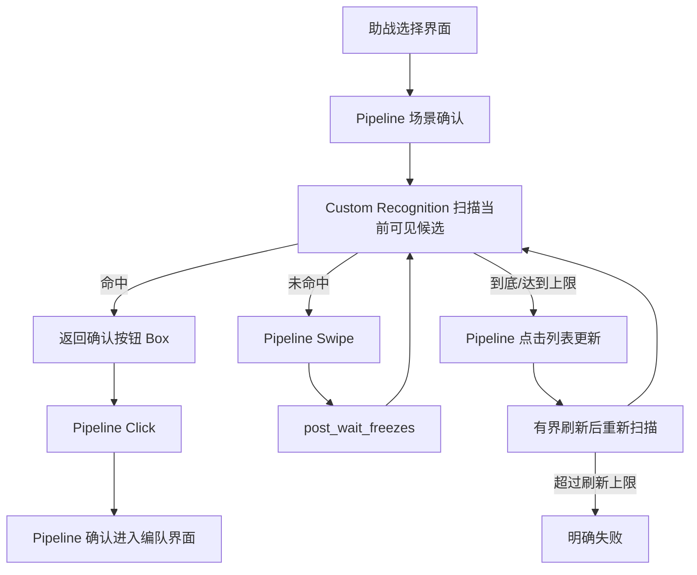
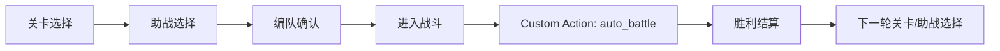

# MaaFgo 助战选择技术方案

> **状态**：讨论稿，尚未实现
> **版本**：v0.1
> **日期**：2026-08-03
> **分支**：`feat/auto-battle-planner`
> **参考截图**：[助战选择界面](screenshot/8-3/助战选择界面.png)

---

## 1. 背景

当前原生自动战斗已经具备固定 `BattlePlan / TurnPlan`、本地战斗感知、技能安全跳过、Action Validator 与 Executor 主链路。完成一次战斗后，外层周回流程可能再次进入 FGO 助战选择界面。现有项目只具备“确认已进入助战选择界面”的模板节点，尚不能根据条件寻找并选择助战。

本方案新增一个 MaaFramework 原生风格的助战选择模块，支持：

- 指定目标从者；
- 设置从者等级下限；
- 设置宝具等级下限；
- 在当前可见列表中逐行识别候选；
- 未命中时滑动列表继续查找；
- 到底或达到搜索上限后刷新列表；
- 有界重试，最终未找到时明确失败；
- 选择后确认已离开助战列表并进入编队界面。

该功能属于战前导航/编排层，不进入 `AutoBattleRuntime`。

---

## 2. 目标与非目标

### 2.1 第一阶段目标

第一阶段实现以下条件：

```text
servant == target_servant
and servant_level >= min_servant_level
and np_level >= min_np_level
```

找到第一个满足条件的可见候选后，点击该候选右侧的“助战编入确认”按钮。

### 2.2 后置能力

以下条件保留扩展位，但不进入第一版：

- 技能等级要求；
- 概念礼装身份与等级要求；
- 满破礼装要求；
- 好友/非好友限制；
- 登录时间限制；
- Fou、附加技能、宝具色等条件；
- 扫描全列表后选择最高等级或最高宝具候选；
- Vision/LLM 参与识别；
- 开放式识别所有 FGO 从者。

### 2.3 明确非目标

- 不在 Python 中另写完整的截图、滑动、点击循环；
- 不把助战搜索塞进战斗 Runtime；
- 不允许无限滑动或无限刷新；
- OCR 失败时不使用假默认值；
- 不因为识别到目标头像就忽略等级和宝具条件。

---

## 3. 当前代码现状

现有节点：

```text
assets/resource/base/pipeline/冠位戴冠战.json
  └── 冠位戴冠战-助战确认
```

该节点使用：

```json
{
  "recognition": {
    "type": "TemplateMatch",
    "param": {
      "template": ["助战选择界面标记.png"]
    }
  }
}
```

当前只能确认页面，不能：

- 识别列表中的从者；
- 读取从者等级；
- 读取宝具等级；
- 将多个字段关联到同一行；
- 滑动寻找；
- 更新列表；
- 选择候选并验证跳转。

现有资源中已经有：

```text
assets/resource/base/image/助战选择界面标记.png
assets/resource/cn/image/助战选择界面标记.png
```

新模块应复用该场景入口，不重复建立另一套助战页面判断。

---

## 4. 界面结构分析

参考截图分辨率为 `1280×720`。界面大致分为：

| 区域 | 内容 | 第一版用途 |
|---|---|---|
| 顶部 | 职阶筛选、信息切换、列表更新、排序 | 职阶预筛选、列表刷新 |
| 中部 | 多条助战记录 | 候选扫描 |
| 每行左侧 | 从者头像、从者等级 | 身份与等级识别 |
| 每行中部 | 玩家、从者名、宝具名、宝具等级 | 身份辅助与宝具等级识别 |
| 每行右侧 | 技能、友情点、确认按钮 | 返回最终点击框 |
| 最右侧 | 滚动条 | 到底辅助判断 |

### 4.1 不采用固定三行坐标

截图当前可见约三条记录，但列表滑动后可能出现：

- 顶部半行；
- 底部半行；
- 任意 Y 偏移；
- 不同设备渲染造成的轻微位置变化。

因此不能简单写死：

```text
row1 = y 170
row2 = y 350
row3 = y 530
```

推荐先识别每行右侧重复出现的“助战编入确认”按钮，把按钮作为行锚点，再反推出该行其他字段的相对 ROI。

---

## 5. MaaFramework 架构原则

采用“Pipeline 主导 + Custom Recognition 补充”的结构。



### 5.1 Pipeline 负责

- 助战页面场景确认；
- 职阶筛选点击；
- Custom Recognition 节点编排；
- 点击识别结果框；
- `Swipe`；
- `post_wait_freezes`；
- `next / on_error`；
- `max_hit / timeout`；
- 列表更新；
- 进入编队界面的后置确认；
- 任务成功或失败状态。

### 5.2 Custom Recognition 负责

只回答：

> 当前截图中是否存在满足条件的助战；若存在，返回哪一个确认按钮的 Box。

Custom Recognition 不负责：

- 获取新的设备截图；
- 滑动列表；
- 点击按钮；
- 刷新列表；
- 驱动完整任务状态机。

这能让滑动、点击、重试和节点日志继续处于 MaaFramework Pipeline 调试体系中。

---

## 6. 建议模块结构

```text
agent/custom/
└── support_recognition.py
    ├── SupportCandidateRecognition
    ├── SupportRequirement
    ├── SupportCandidate
    └── OCR/模板结果解析辅助函数

assets/resource/base/pipeline/
└── 助战选择.json

assets/resource/base/image/support/
├── select_button.png
├── list_refresh.png
├── list_marker.png
└── servants/
    └── <servant_key>/
        ├── portrait_1.png
        ├── portrait_2.png
        ├── portrait_3.png
        └── costume_*.png

assets/options/
├── support_servant.json
├── support_min_level.json
├── support_min_np_level.json
├── support_max_swipes.json
└── support_max_refreshes.json
```

注册入口：

```python
@AgentServer.custom_recognition("support_candidate")
class SupportCandidateRecognition(CustomRecognition):
    ...
```

并在 `agent/main.py` 导入注册模块。

---

## 7. 配置契约

建议 Pipeline 通过 `custom_recognition_param` 传入：

```json
{
  "servant_key": "target_servant",
  "min_servant_level": 100,
  "min_np_level": 2,
  "class_filter": "moon_cancer",
  "selection_policy": "first_match",
  "friend_only": false
}
```

### 7.1 字段定义

| 字段 | 类型 | 第一版 | 说明 |
|---|---:|---:|---|
| `servant_key` | string | 必需 | 本地从者资源 ID，不直接使用 UI 坐标 |
| `min_servant_level` | int | 必需 | 允许范围建议 1～120 |
| `min_np_level` | int | 必需 | 允许范围 1～5 |
| `class_filter` | string/null | 可选 | 已知职阶时先点击顶部筛选 |
| `selection_policy` | string | 固定 | 第一版为 `first_match` |
| `friend_only` | bool | 后置 | 第一版暂不启用 |

配置非法时 Custom Recognition 应返回明确错误，不进入搜索循环。

---

## 8. 候选识别算法

### 8.1 第一步：定位可见行

对列表右侧区域运行 TemplateMatch，寻找所有“助战编入确认”按钮。

MaaFramework 的识别结果中保留 `all_results`，按 Y 坐标排序：

```text
button[0].box
button[1].box
button[2].box
...
```

每一个按钮对应一条可见助战记录。根据按钮中心 Y 计算行区域：

```text
row_box = [list_left, button_center_y - row_half_height,
           list_width, row_height]
```

只处理达到最小可见高度的完整行；顶部或底部严重截断的半行跳过，等待下一次滑动后再处理。

### 8.2 第二步：识别从者身份

第一版采用：

```text
头像 TemplateMatch 为主
从者名称 OCR 为辅
```

资源目录允许同一从者多个头像版本：

```text
support/servants/<servant_key>/portrait_*.png
```

只要任一模板在当前行头像 ROI 中达到阈值，该行进入下一步。

名称 OCR 第一版只作为：

- 日志证据；
- 调试对照；
- 头像模板不足时的后续兜底扩展。

不建议第一版强制“头像和 OCR 名称必须同时命中”，否则 OCR 波动会降低可用性。

### 8.3 第三步：读取从者等级

只对当前行左侧等级区域运行 OCR，目标文本示例：

```text
等级100/100
```

解析第一个合法整数：

```python
servant_level = 100
```

判断：

```python
servant_level >= min_servant_level
```

OCR 未读到 1～120 内的合法值时：

```text
servant_level = unknown
```

该候选不满足条件，不能默认通过。

### 8.4 第四步：读取宝具等级

只对当前行中部“宝具信息条”运行 OCR，目标文本示例：

```text
宝具 原理血戒·断头台 等级1
宝具 依然存在的梦想之城 等级3
```

必须严格限制 ROI，避免误读同一行上方的玩家等级，例如：

```text
等级159
```

解析范围：

```text
宝具等级 = 1～5
```

判断：

```python
np_level >= min_np_level
```

OCR 无法解析时同样视为不满足。

### 8.5 第五步：返回候选

候选模型建议为：

```python
@dataclass(frozen=True)
class SupportCandidate:
    servant_key: str
    servant_level: int | None
    np_level: int | None
    row_box: tuple[int, int, int, int]
    confirm_button_box: tuple[int, int, int, int]
    identity_confidence: float
    level_confidence: float
    np_confidence: float
```

第一版从上到下扫描，返回第一个满足全部条件的 `confirm_button_box`。

Custom Recognition detail 中记录：

```json
{
  "matched": true,
  "servant_key": "target_servant",
  "servant_level": 100,
  "np_level": 3,
  "row_index": 2,
  "reject_reasons": []
}
```

未命中时记录每个候选的拒绝原因：

```text
row1: servant_mismatch
row2: servant_level_below_minimum
row3: np_level_below_minimum
```

---

## 9. 选择策略

第一版推荐 `first_match`：

```text
从上到下找到第一个满足全部下限的候选，立即选择。
```

不推荐第一版做 `best_match`：

```text
扫描完整列表 → 比较最高宝具/最高等级 → 回到历史位置 → 再选择
```

原因：

- 候选可能已经滚出当前屏幕；
- 需要记录和恢复滚动位置；
- 列表刷新后内容可能变化；
- 提高复杂度但对“满足下限即可”的需求收益有限。

后续可在同屏多个候选之间做局部排序，但不跨屏寻找全局最优。

---

## 10. 滑动与到底检测

### 10.1 滑动

使用 Pipeline 原生 `Swipe`，不在 Custom Recognition 内调用 Controller：

```text
列表下部 → 列表上部
```

每次滑动后：

```json
{
  "post_wait_freezes": 500
}
```

等待列表稳定后再次识别。

### 10.2 硬上限

建议初始值：

```json
{
  "max_swipes_per_pass": 8,
  "max_refreshes": 2
}
```

硬上限用于防止：

- 列表无法滚动；
- 页面识别错误；
- 滑动无效；
- 目标条件过严；
- 无限刷新。

### 10.3 到底判断

推荐组合策略：

1. `max_swipes_per_pass` 为硬上限；
2. 检测右侧滚动条是否接近底部；
3. 比较滑动前后列表主体变化，连续两次无有效位移则提前结束。

不能只比较整张截图哈希，因为登录时间、动态 UI 或轻微动画可能改变像素。

可比较：

- 行锚点 Y 分布；
- 可见头像模板集合；
- 列表主体降采样特征；
- 滚动条滑块位置。

第一版可以先使用“最大滑动次数 + 滚动条底部模板”，画面特征比较后置。

---

## 11. 列表更新

达到底部或滑动上限仍未命中：

```text
TemplateMatch 列表更新按钮
→ Pipeline Click
→ 等待画面稳定
→ 再次确认助战选择场景
→ 从顶部重新扫描
```

刷新必须限次。建议默认：

```text
最多刷新 2 次
```

最终失败结果：

```text
support_not_found:
servant=<servant_key>,
min_level=<N>,
min_np_level=<N>,
swipes=<N>,
refreshes=<N>
```

如果列表更新按钮处于不可用状态，应等待一个有界时间；超过时间后失败，不能无限等待。

---

## 12. Pipeline 状态机草案

节点命名建议：

```text
助战选择入口
助战选择-场景确认
助战选择-职阶筛选
助战选择-候选匹配
助战选择-候选点击
助战选择-点击后确认
助战选择-列表滑动
助战选择-到底检测
助战选择-列表更新
助战选择-失败
```

伪 Pipeline：

```jsonc
{
  "助战选择入口": {
    "next": ["助战选择-场景确认"]
  },

  "助战选择-场景确认": {
    "recognition": {
      "type": "TemplateMatch",
      "param": {
        "template": "助战选择界面标记.png"
      }
    },
    "next": ["助战选择-候选匹配"]
  },

  "助战选择-候选匹配": {
    "recognition": {
      "type": "Custom",
      "param": {
        "custom_recognition": "support_candidate",
        "custom_recognition_param": {
          "servant_key": "target_servant",
          "min_servant_level": 100,
          "min_np_level": 2
        }
      }
    },
    "action": {
      "type": "Click"
    },
    "next": ["助战选择-点击后确认"]
  },

  "助战选择-列表滑动": {
    "action": {
      "type": "Swipe",
      "param": {
        "begin": [1000, 610, 1, 1],
        "end": [1000, 230, 1, 1],
        "duration": 500
      }
    },
    "post_wait_freezes": 500,
    "max_hit": 8,
    "next": ["助战选择-候选匹配", "助战选择-列表滑动"]
  }
}
```

以上仅为职责和流向草案，最终 JSON 要根据 MaaFramework 节点回溯、`max_hit` 计数重置和列表更新行为进一步拆分，不能直接当作最终实现提交。

---

## 13. 选择后确认

点击候选后必须进行后置确认：

```text
助战选择界面消失
并且
编队确认/队伍界面出现
```

如果点击后仍然停留在助战列表：

1. 等待短暂画面稳定；
2. 有界重试点击一次；
3. 仍未跳转则返回 `support_click_not_confirmed`。

不能在没有确认跳转的情况下继续点击编队或开始任务。

---

## 14. 与原生自动战斗的集成

助战选择位于外层 Pipeline：



不建议：

```text
AutoBattleRuntime.run()
  └── 战斗结束后直接承担助战选择
```

原因：

- 战斗 Runtime 应只处理战斗场景；
- 助战选择也应能被 BBC 或其他战斗后端复用；
- 页面导航更适合 Pipeline 调试和复用；
- 避免战斗状态机继续膨胀。

---

## 15. 日志与证据

Custom Recognition 每次调用至少记录：

```text
support scan start
visible_rows=3
target_servant=<key>
min_level=100
min_np_level=2
```

每行记录：

```text
row=1 identity=matched level=90 np=5 result=level_too_low
row=2 identity=matched level=100 np=1 result=np_too_low
row=3 identity=matched level=100 np=3 result=accepted
```

Pipeline 记录：

```text
scan_pass=1 swipe=0
scan_pass=1 swipe=1
refresh=1
support selected row=3
formation scene confirmed
```

失败时建议保存：

- 最后一张助战列表截图；
- 当前搜索条件；
- 可见候选识别结果；
- 滑动次数；
- 刷新次数；
- 最终失败原因。

第一版可以先记录日志，截图证据与统一 `save_evidence` 后续合并。

---

## 16. 测试计划

### 16.1 阶段 A：离线截图识别

只使用参考截图，不点击设备。

验证：

- 能定位当前可见行；
- 能返回每行确认按钮 Box；
- 能识别目标头像；
- 能读取从者等级；
- 能读取宝具等级；
- 不会把玩家等级误认为宝具等级；
- OCR 失败时返回 unknown。

### 16.2 阶段 B：当前屏幕选择

真机停留在助战选择界面，不滑动。

验证：

- 当前屏幕存在合格候选时点击正确行；
- 身份相同但等级不足时不点击；
- 身份相同但宝具不足时不点击；
- 点击后确认进入编队界面。

### 16.3 阶段 C：滑动寻找

将目标放在首屏之外。

验证：

- 滑动方向和距离正确；
- 滑动后等待画面稳定；
- 不重复扫描同一屏；
- 找到后停止继续滑动；
- 到底后不无限滑动。

### 16.4 阶段 D：列表更新

首轮列表中不存在满足条件的候选。

验证：

- 到底后点击列表更新；
- 更新后从顶部重新扫描；
- 达到刷新上限后明确失败；
- 更新按钮不可用时有界等待。

### 16.5 阶段 E：周回集成

完整链路：

```text
关卡 → 助战选择 → 编队 → 战斗 → 结算 → 下一轮助战选择
```

验证多轮运行不会残留：

- 上一次滑动计数；
- 上一次候选 Box；
- 上一次截图哈希；
- 上一次刷新计数。

---

## 17. 验收标准

第一版验收目标：

| 项目 | 标准 |
|---|---|
| 页面确认 | 非助战页面不启动搜索 |
| 行定位 | 当前可见完整行全部识别，不跨行关联字段 |
| 从者身份 | 目标模板命中；非目标不误选 |
| 等级条件 | `recognized >= minimum` 才通过 |
| 宝具条件 | `recognized >= minimum` 才通过 |
| OCR 未知 | 不默认通过 |
| 点击 | 点击返回的同一行确认按钮 |
| 滑动 | 使用 Pipeline Swipe，有界执行 |
| 刷新 | 有最大刷新次数 |
| 后置确认 | 必须确认进入编队界面 |
| 失败 | 有明确 reason，不无限循环 |
| 复用 | 不依赖 `AutoBattleRuntime` |

---

## 18. 主要风险

### 18.1 再临与灵衣头像差异

同一从者可能显示不同头像，需要多个模板。解决方案：

- 允许模板集合；
- 初期收集目标从者实际助战截图；
- 名称 OCR 作为辅助证据。

### 18.2 OCR 文本描边与背景干扰

等级文本存在描边、图标和复杂背景。解决方案：

- 严格行内 ROI；
- `only_rec` 与颜色过滤对比测试；
- 对常见 OCR 错误做数字归一化；
- 保留置信度门槛。

### 18.3 玩家等级与宝具等级混淆

同一行同时存在玩家等级和宝具等级。解决方案：

- 宝具 OCR 只裁宝具信息条；
- 要求结果位于“宝具”文本附近；
- 宝具等级必须为 1～5。

### 18.4 滑动后行位置不固定

不能依赖固定 Y 坐标。解决方案：

- 使用确认按钮作为动态行锚点；
- 每次滑动后重新定位全部行。

### 18.5 列表刷新与网络延迟

刷新后列表可能短时间空白。解决方案：

- Pipeline `post_wait_freezes`；
- 再次确认助战场景；
- 设置总超时。

### 18.6 条件过严导致无限搜索

解决方案：

- 最大滑动次数；
- 最大刷新次数；
- 总超时；
- 明确失败，不自动放宽用户条件。

---

## 19. 分阶段开发顺序

```text
S1 参考截图行定位
  ↓
S2 目标头像模板匹配
  ↓
S3 从者等级 OCR
  ↓
S4 宝具等级 OCR
  ↓
S5 Custom Recognition 返回确认按钮 Box
  ↓
S6 Pipeline 当前页点击与跳转确认
  ↓
S7 Pipeline Swipe 循环
  ↓
S8 到底检测与列表更新
  ↓
S9 GUI 参数与外层周回集成
```

每一步独立验收，不在第一轮同时实现全部功能。

---

## 20. 下次讨论需要确认的问题

### 20.1 目标从者

- 第一位用于开发和标定的目标从者是谁？
- 是否已有该从者不同再临/灵衣的助战头像截图？

### 20.2 选择策略

推荐：

```text
找到第一个满足下限的候选立即选择。
```

待确认是否需要：

- 同屏候选中优先宝具更高；
- 同屏候选中优先等级更高；
- 必须好友；
- 非好友也可接受。

### 20.3 搜索上限

推荐初始值：

```text
每轮最多滑动 8 次
列表最多更新 2 次
```

待真机根据列表长度与滑动距离调整。

### 20.4 条件无法满足时的策略

推荐：

```text
保持原条件并停止，输出 support_not_found。
```

不建议默认自动放宽：

- 宝具等级；
- 从者等级；
- 从者身份。

如需放宽，应由用户显式配置优先级和最低底线。

### 20.5 职阶预筛选

如果目标从者职阶已知，推荐先点击顶部对应职阶，减少列表长度和误识别。待确认：

- 是否始终按职阶筛选；
- EXTRA 职阶如何处理；
- 特殊关卡固定助战是否跳过筛选。

---

## 21. 当前建议结论

第一版采用：

```text
MaaFramework Pipeline
  负责场景、职阶、Swipe、Click、刷新、重试与后置确认

Custom Recognition
  负责同屏行定位、目标头像、等级、宝具等级和候选 Box
```

默认策略建议：

```json
{
  "selection_policy": "first_match",
  "max_swipes_per_pass": 8,
  "max_refreshes": 2,
  "on_not_found": "stop",
  "auto_relax_requirements": false
}
```

下一步不直接写完整滑动搜索，而是先使用现有截图完成“可见行结构化识别”离线原型，证明身份、等级和宝具等级可以稳定关联到同一行，再接入 Pipeline 点击与滑动。